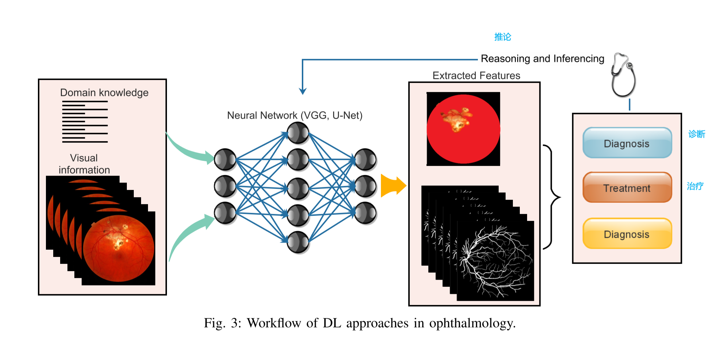
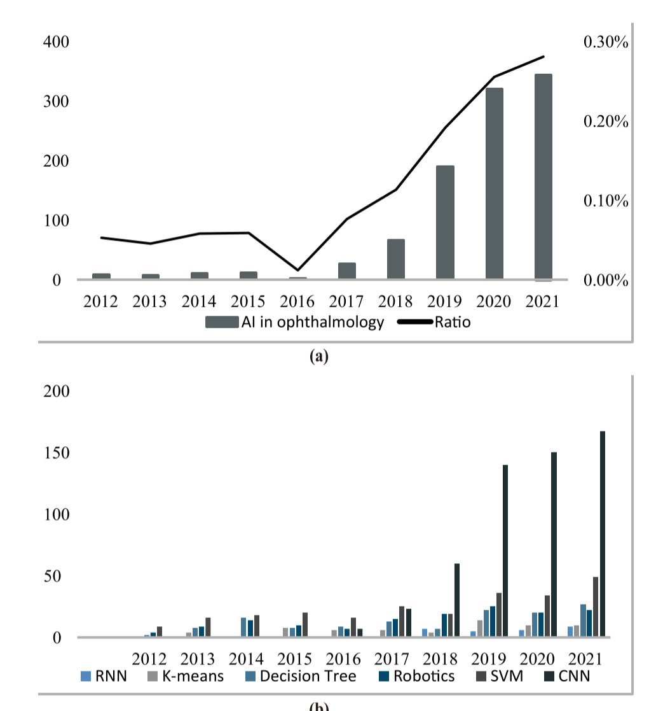
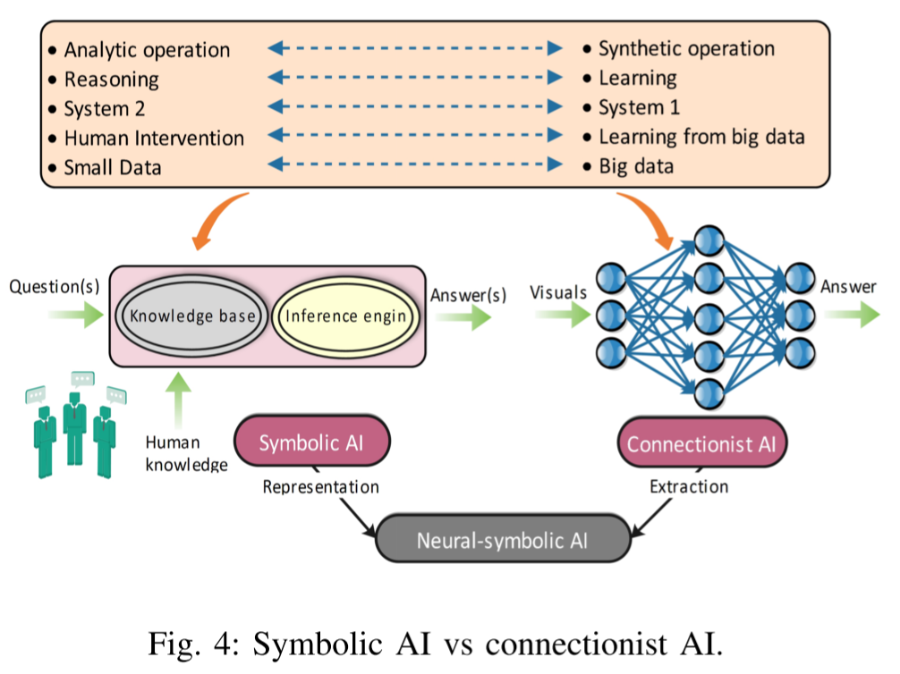

# 神经符号NEURO-SYMBOLIC learning 在眼科的应用


Symbolic AI : **符号是人类大脑的一种主观对象，人类的认知基本上就是建立在符号的基础上的。符号对应于客观事物，就是主观与客观的对应。人类语言就是一种符号系统，人类用语言来表达思维的活动过程。** 从人类语言几乎万能的表达能力，我们就可以看出符号主义的强大之处。然而，符号主义主要依靠具象的过程来运作，比如逻辑，需要我们给出每一步的具体表达。但人类还具有形象思维，很多时候我们自己也说不出思维的过程，这显然用简单的符号主义很难实现。并且客观世界是连续的、复杂的，单纯的用符号主义来表示就会丢失很多信息。

Connectionist AI: **连接主义是类似于人类大脑神经元连接的一种理论，深度神经网络就是很好的成果。** 

**比符号主义更偏向于形象思维，但是他就像一个黑箱，人类并不能完全的分析清楚他的每一步运作原理**，这就导致我们不可能把我们的思维过程在机器上实现，所以单纯的用连接主义来实现通用人工智能是最不靠谱的方法。


## 摘要

## 第一段

**神经符号学习 (NeSyL) 是一个相对较新的领域，它结合了符号学习和人工智能 (AI) 的各个方面。 NeSyL 将优秀的老式 AI 与先进的机器学习 (ML) 和深度网络混合在一起，形成令人兴奋的可解释 AI。**

NeSyL 扩展了 AI 功能，并在不同领域以更高的准确度超越了最先进的深度学习模型，特别是在医学成像和视频推理方面。

该领域的研究人员有兴趣了解大脑如何学习和表示知识，以及如何使用这些知识来改进基于人工智能的系统。

**首先概述了该领域的当前状态。**

**讨论了一些需要解决的关键挑战**，以推动该领域的发展。

最后，**提出了未来可能的方向，以将 NeSyL 的应用范围扩大到不同的关键领域。**

在临床实践中，人工智能在眼科疾病领域具有越来越重要的意义[9]、[10]、[11]（图1），包括筛查、诊断、病灶分割、治疗和预后。人工智能在临床和眼科领域有着广泛的应用，例如学术研究和创业。因此，我们以眼科为例来说明 NeSyL
在临床中的应用。在过去十年中，人工智能在眼科中的应用呈指数级增长（图
2）。眼科中的人工智能涵盖了广泛的眼部疾病，例如白内障、青光眼、近视和糖尿病视网膜病变。人工智能引导分析这些疾病的工作流程由图像分类、分割、目标检测和预测组成。虽然眼科领域已经采用了各种AI算法；然而，深度学习（DL）是主要的。考虑到当前的进展，我们将眼科中的人工智能应用分为三个任务。然后我们讨论了
NeSyL 方法来解决人工智能应用中的挑战，例如分类、分割和检测到未来的应用。

人工智能在眼科的应用包括：
1）眼科疾病的图像分类和检测，以检查病理严重程度；

2) 将视网膜图像根据特征和属性分割成不同的部分；
3) 疾病预测，如眼睛相关并发症（图 3）。




过去十年人工智能在眼科和不同机器学习方法中的应用的比较描述。   
x 轴显示百分比增长，y 轴显示从 2012 年到 2022 年的逐年划分。  
（a）人工智能在眼科中的应用。 (b) 不同最先进机器学习方法的应用。

### A. Classification

已经提出了几种 DL 方法，以端到端的学习方式基于图像特征对健康和病理病例进行分类。该研究 [12] 使用两阶段方法将检索到的椎间盘分类为健康或青光眼患者。第一步，使用卷积神经网络从视网膜眼底图像中定位和提取视盘。

在第二步中，应用深度卷积网络来实现 0.874 的曲线下面积 (AUC)，其中观察到比之前的最佳结果提高了 2.7% [13]。张等人 [14] 提出了一种基于残差注意力的多模型集成方法作为对象识别网络，通过集成三个神经网络从眼睛的 b
超声图像中提取眼球用于白内障分类。 AUC 为 0.975，优于其他方法。然而，某些研究在疾病严重程度方面嵌入了额外的信息来对图像进行分类。万等人。 [15]，使用带有迁移学习的卷积神经网络 (CNNs) 模型对 Kaggle
进行糖尿病视网膜病变 (DR) 分类，分类准确率为 95.68%，AUC 为 0.97。彭等人。 [16] 提出了第一个基于患者的评分系统，通过将 De.pdfeeNet 模型与年龄相关眼病研究 (AREDS) 的简化严重程度量表 (0-5
分) 相结合，模拟年龄相关性黄斑变性 (AMD) 分类过程双侧彩色眼底图像。

### B. Segmentation

视网膜图像模式的变化需要复杂的深度学习分割模型。

例如，Yan 等人。 [17] 提出了一种**类似于 U-Net 的血管分割自动编码器**，它结合了段和像素级损失。与基于整体损失的模型相比，这种具有两个分支的框架学习了血管分割的可区分特征。阿克拉姆等人。 [18]
提出了用于视网膜血管分割的生成对抗网络，在准确性、F1 分数和 AUC 方面取得了令人满意的结果。然而，该方法可能在薄血管分割上**表现不佳**。对于视盘 (OD) 分割，Fu 等人。 [13] 开发了 **
MNet，以在一个阶段的多标签框架中联合解决 OD 和视杯（OC）分割。**

与单尺度网络相比，在多尺度输入和侧输出层的情况下，M-Net 取得了显着的成果。阿尔班德等。 [11] 使用多尺度顺序 CNN 在 Messidor [19] 和 Kaggle 数据集 [20] 上同时检测中央凹和
OD。所提出的方法对预处理不太敏感，并且不需要血管分割或边界定位来检测 OD 和中央凹中心。 Huang等人提出了区域提议和级联网络。 [21] 实现稳健有效的 OD 检测和中央凹定位。

### C. Prediction

ML 应用也已扩展到眼部疾病的估计。其中，屈光不正是导致视力障碍的主要原因 [22]。传统的机器学习算法，
如**随机森林 (RF) 和支持向量机 (SVM)**，通过球面等效性 (SE) 和年龄 [23]、[24] 等数值数据来**预测近视的发生**，而**深度神经网络（DNN）被用来预测使用视网膜眼底图像的屈光不正的进展**[25]
。戈登等人。 [26] 应用传统的 Cox 比例风险回归模型来评估未经治疗的高眼压导致青光眼进展的风险，并评估长期眼内压 (IOP) 的影响。江等人。 [27]**
利用深度时间序列，使用CNN提取特征并通过长期短期记忆（LSTM）探索时间信息来预测后囊膜混浊的进展。**除了进展之外，预测眼科治疗的结果是 ML 的另一个常规应用。 Wolf-Dieter Vogl 等人。 [28]
应用纵向混合效应模型来预测渗出性黄斑疾病患者抗 VEGF 治疗的结果。

### D. AI Limitations and NeSyL

尽管人工智能在眼部图像处理中得到广泛应用，但在可用数据集和机器学习模型方面存在局限性，这阻碍了其在临床试验中的实施。

通常，从医院获得的注释数据是有限的，特别是在分割或检测任务中，其中基本事实需要专家注释。有时数据不平衡，质量和分布不同。一些数据集在种族群体中是同质的，在现实世界的应用中缺乏普遍性。医学数据集反映了真实临床环境中的真实分布，但微小的不平衡可能会导致
DL 模型对少数标记类的结果不佳。
深度学习是处理人眼图像的主流方法，因为它具有提取特征的能力。

然而，**在可解释性、适应性和推理能力方面的黑盒表示可能会导致较差的结果** [29]。

针对上述局限性，本次调查**讨论了 NeSyL 的基本原理**，并提出了其在眼科疾病、诊断和预测中的潜在应用，并**规避了 DNN 的局限性。**

## 第二段 -- 神经符号人工智能的原理

### Symbolic AI versus Connectionist AI 符号 AI 与连接主义 AI

多年来，人工智能领域主要有两种思想流派，即符号人工智能（sAI）和联结主义人工智能（cAI）。 Hubert 和 Stuart Dreyfus [33] 将 sAI 和 cAI 之间的相关性定义为：**制造思想与模拟大脑** 。

**根据人类的认知能力，心智的创造（sAI）通常通过符号操作和语言处理从更高的认知水平开始。另一方面，大脑 (cAI) 的创建从最低认知水平开始，通过发展神经元及其相互连接。**

```
这句话不是很理解。。。cAI是基础，是思想的诞生？ 思想诞生后经过逻辑处理，这个处理手段是sAI？？？
```
Todo： 
不懂，等会问问


此外，Kahneman [34] 提出了二进制架构（称为 System-1 和 System2）的概念，以解释人类在各种脑力任务上的处理速度差异的结果。同样，cAI 可以归类为 System-1，而 sAI 被认为属于 System-2。图4 显示了 sAI 和 cAI 之间的主要区别。



符号 AI：sAI 有一个别名列表，包括经典 AI、基于规则的 AI 和良好的老式 AI (GOFA) [35]。从 1950 年代中期到 1990 年代中期，大部分 AI 研究都集中在 sAI，它依赖于将人类知识和行为规则嵌入计算机代码 [36]。

**sAI 假设符号是人类智能的基本单位。**
同样，**人类的认知过程是一系列关于符号表征的明确推论**。从认知的角度来看，**sAI对应的是分析操作**，**大多与高层次的、可分解的、有意识的、推理的任务相关**。在分析操作中，存在使用明确的高级信息的有意识的思考过程和有意识的决策。符号知识和命题知识所涉及的知识与语言有关。发现 sAI 和分析操作共享许多特征，例如顺序可分解性和命题知识。 sAI 的应用处理字符串，通过符号表示现实世界的实体或概念。所有符号都可以按层次排列或通过列表和网络排列，这决定了符号之间的算法关联[37]。

**sAI 系统通常指的是逻辑推理、演绎推理和一些旨在解决特定模型约束的搜索算法** [38]。专家系统属于这个系统，它基于人类创造的知识，通常包含指示算法行为的 if/then 配对语句。推理引擎模型参考知识库并选择与给定符号或符号集相对应的规则。 sAI 已广泛用于具有明确规则和目标的任务 [39]、[40]。然而，离散推理的算法复杂度是非确定性多项式时间 (NP)，在此类算法中需要大量手动调整，这使得它们难以解决复杂问题。 sAI 在建模不确定和模棱两可的知识方面面临困难。解决现实世界任务和超大空间的尝试是一个具有挑战性的问题。

---
2) Connectionist AI：cAI 的名称**来自该类别中使用的典型网络拓扑**。它是人工智能领域的**主导范式**，因为在存在大数据集的情况下连接主义的技术成功。 **cAI 根据人脑如何通过其相互连接的神经元工作来对过程进行建模，这通常应用感知器来表示单个神经元**。从认知的角度来看，它对应于合成操作，它们主要关注低层次的、无意识的、不可分解的、感知的任务。视觉和语音识别是典型的任务，涉及以口头和非命题方式表达的知识限制。然而，语义知识的有效利用可以提高 CNN 的性能。

通常，**cAI 系统从没有或很少有先验知识的大规模数据中学习关联**。相反，**sAI 可以通过人类手动编码的程序构建**。**cAI 由各种神经网络组成，例如 CNN、DNN 和图神经网络 (GNN)**。 cAI 在模式识别和泛化方面提供了良好的性能。但是，它通常**无法解释**它是如何得出解决方案的，而自动驾驶汽车和医学等安全关键领域非常需要这种解决方案。它还需要大量数据来确保高训练和测试精度，这对于某些任务来说是不现实的

---

3）符号和连接主义人工智能：许多科学家一致认为，**不同抽象层次的信息在结构和构成上是不同的**。他们假设较低层次的抽象是子符号的，而较高层次的抽象是符号的。 Hugo Latapie [41] 提出认知不是二元论的，任何抽象层次的知识都涉及神经符号信息，换句话说，符号和子符号信息都包含在两个层次的数据中。这意味着将**神经符号模型实现为用于信息处理的自然模拟机器，可以累积连接主义（cAI）和符号（sAI）能力。**
**_神经符号 AI 或 NeSyL 可以使用连接主义方法从数据中提取特征，然后通过符号方法操纵这些特征。_** 事实证明，神经符号 AI 只需训练数据的第 10 部分即可快速收敛。科学家们认为，**神经符号人工智能将赋予人工智能学习和推理的能力，同时无需大量培训即可执行各种任务**。

Symbolic component regularizes the neural learning, while neural components help model scaling and guide discrete decisions.  
符号组件规范了神经学习，而神经组件有助于建模缩放和指导离散决策。

### B. Integration Methods: Hybrid Versus Unified


各种方法用于整合神经和符号AI。一般来说，不同的任务和研究适合使用不同的集成方法。由于复杂的控制流和低操作强度的操作，**NeSyL 比传统的神经模型更难以在并行计算中实现**。当它们明显可分离时，计算的神经学习在符号推理中占主导地位。

1995 年，Yannic 等人。努力为神经符号整合奠定认知基础，并描述了当时采用的不同策略[42]。该研究 [43] 确定了构建神经符号集成模型的两种主要方法：混合和统一hybrid and unified。

#### Hybrid Methods:
混合方法结合了独立的子模块，**包括几个神经和符号子模块**。每个子模块都有自己的角色并执行不同的功能。神经**子模块主要负责感知任务**，而**符号子模块负责推理分析**。翻译和功能混合是 Hilario 等人总结的两种混合方法。 [44]，其中功能混合进一步分为链处理、子处理、元处理和协处理。加塞兹等人。在 [45]、[46]、[47] 中介绍了他们对混合方法的研究，作为神经符号整合的早期努力。近年来，许多关于神经符号的研究[48]、[49]、[50]、[51]都使用了混合方法。**混合系统中的子模型可以单独构建**，其中混合方法可以直接受益于神经网络和符号学的进步。然而，混合系统可能无法反映生物现实[52]。 Gary Marcus 声称 Hybrids 通常是有效的 [53]。

#### Unified Methods:
统一方法通过向神经或符号方法添加另一种范式来利用(utilize)连接主义和符号能力。统一的方法进一步分为两种情况。**第一种情况将符号集成到神经网络中**，**第二种情况构建用于符号处理的神经架构**。除子模型外，统一方法也可以视为端到端方法。但是，统一模型可以用作混合系统中的子模型。正如 Garcez 等人。属于第一种情况的提议逻辑可以被认为是编译神经网络的语言[54]。大脑的统一结构应该具有生物学上的合理性，并可能导致发现。此外，统一系统在大规模并行处理中具有计算效率和生物保真度的优势。然而，统一方法的可扩展性较差[52]。

### C. NeSyL Components
在本节中，我们描述了**神经符号系统的组成部分**，包括**注意机制attention mechanisms**、**知识图谱knowledge graphs**和**表示方法representation methods**。他们可以合作以取得更好的结果。


